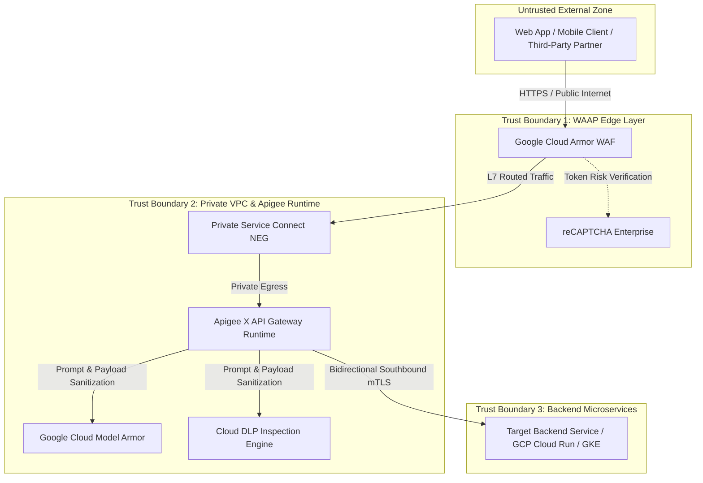

# ASPR Enterprise Threat Model & Risk Assessment
### *STRIDE & OWASP API Top 10 (2023) Framework for Apigee X & WAAP*

---

## 1. Asset & Target Information

| Parameter | Specification / Value |
| :--- | :--- |
| **API Name / Target Proxy** | `{API_NAME}` (e.g. `PaymentGatewayProxy`) |
| **Base Endpoint URL** | `{BASE_URL}` (e.g. `https://api.boticario.com.br/v1/payments`) |
| **Data Classification** | `{DATA_CLASSIFICATION}` (e.g. `CONFIDENTIAL / PII / PCI-DSS`) |
| **GCP Project & Environments** | `{PROJECT_ID}` / Environments: `staging`, `prod` |
| **Security Architect Agent** | ASPR Autonomous AI Super Agent (Gemini Engine) |
| **Assessment Timestamp** | `{DATE_ISO}` |

---

## 2. Data Flow Diagram (DFD) & Trust Boundaries

---

## 3. STRIDE Threat Matrix & ASPR Mitigation Controls

| STRIDE Category | API Threat Description | Risk Level | ASPR Mitigation & Hardening Control | Remediation Playbook |
| :--- | :--- | :---: | :--- | :--- |
| **S** - *Spoofing* | Identity theft, forged JWT bearer tokens, or token replay attacks. | **CRITICAL** | Enforce OAuth 2.1 + PKCE, strict cryptographic signature verification, and claims check. | `07_deploy_hardened_api_proxy.sh` |
| **T** - *Tampering* | Malicious JSON payload alterations or SQL/Command injection in transit. | **HIGH** | Cloud Armor ModSecurity CRS 3.3 inspection rules + `JSONThreatProtection` limits. | `sec_01_cloud_armor_crs_tuning.sh` |
| **R** - *Repudiation* | Denial of executed transactions due to lack of tamper-proof audit trails. | **MEDIUM** | Pre-obfuscation structured `MessageLogging` ingested into Google SecOps / Chronicle SIEM. | `09_audit_api_security_health.sh` |
| **I** - *Information Disclosure* | Unintended PII / PCI leakage or raw backend 500 stack trace exposure. | **CRITICAL** | Real-time Cloud DLP de-identification + global `FaultRules` with `AssignMessage` error masking. | `08_configure_ai_security_model_armor.sh` |
| **D** - *Denial of Service (DoS)*| Volumetric burst floods, resource exhaustion, or layer 7 application floods. | **HIGH** | Cloud Armor L7 Adaptive Protection + Rate-Based Ban (100 req/60s) + `SpikeArrest` (30ps). | `sec_03_rate_limiting_and_ban_policies.sh` |
| **E** - *Elevation of Privilege* | BOLA / BFLA manipulation to access cross-tenant data or administrative routes. | **CRITICAL** | Contextual resource ownership verification and fine-grained OAuth scope RBAC. | `sec_06_inject_security_actions.sh` |

---

## 4. Generative AI & LLM Threat Vectors (OWASP GenAI Top 10)

| OWASP LLM Code | Identified Threat Vector | Risk Level | Applied ASPR Protective Control |
| :--- | :--- | :---: | :--- |
| **LLM01** | Prompt Injection & System Prompt Exfiltration | **HIGH** | Ingress/Egress prompt sanitization via Google Cloud Model Armor. |
| **LLM06** | Excessive Agency & Sensitive Data Over-Exposure | **HIGH** | Real-time PII/PCI masking and token de-identification via Cloud DLP. |
| **LLM10** | Unbounded Consumption (Semantic DoS) | **MEDIUM** | Strict payload size constraints and semantic cache lookup policies in Apigee. |

---

## 5. Residual Risk Score & ASPR Action Plan

- **Residual Risk Score**: `{RISK_SCORE} / 100` (Status: `{RISK_STATUS}`)
- **Scheduled Re-Evaluation Date**: `{NEXT_REVIEW_DATE}`

### Priority Action Plan:
1. [ ] Enforce SpikeArrest and Quota policies on proxy `{API_NAME}`.
2. [ ] Verify that injected Security Actions remain in `FLAG`/`PREVIEW` mode for the mandatory 72-hour baseline.
3. [ ] Run the On-Demand Red Team Fuzzing Simulator (`sec_13_api_red_team_simulator.py`) to generate the official Defense Efficacy Certificate.
